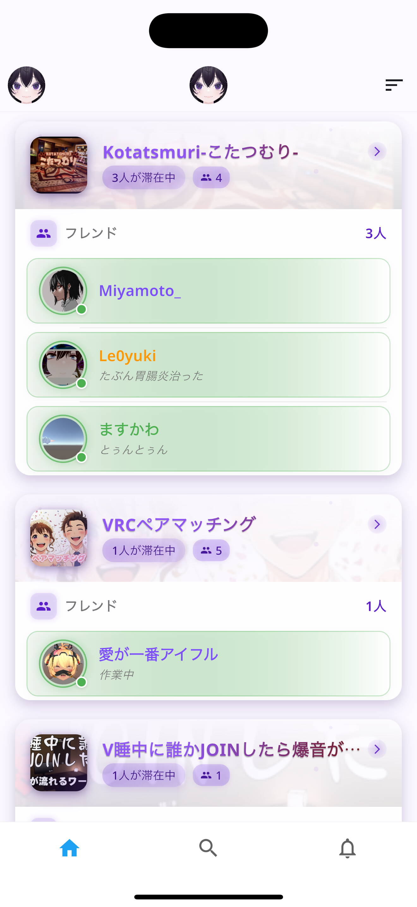
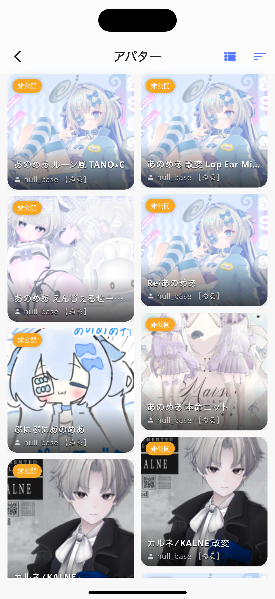

<div align="center">

# VRCN

</div>

<p align="center">
  

<p align="center">
  <a href="https://discord.gg/xAcm4KBZGk"></a>
  
  
   

</p>

## 🌟 概要

VRCNは、VRChatユーザーのための包括的なモバイルコンパニオンアプリです。フレンド管理、ワールド探索、イベント追跡など、VRChatライフを豊かにする多彩な機能を提供します。

**「VRChatをもっと便利に、もっと楽しく」**

## ✨ 主な機能

### 🧑‍🤝‍🧑 ソーシャル機能
- **フレンド管理**: フレンドリストの閲覧、オンラインステータスの確認
- **ユーザー検索**: ユーザー名やプロフィール情報からの検索
- **プロフィール表示**: 詳細なユーザープロフィールの閲覧・編集

### 🌍 ワールド探索
- **ワールド検索**: 人気のワールドや新着ワールドの発見
- **お気に入り管理**: お気に入りワールドのコレクション
- **詳細情報**: ワールドの訪問者数、いいね数などの統計情報

### 👕 アバター管理
- **アバター検索**: カスタマイズ可能な検索フィルター
- **お気に入りアバター**: アバターコレクションの管理
- **詳細表示**: アバターの詳細情報とプレビュー

### 📅 イベント機能
- **イベントカレンダー**: 開催予定のイベントをカレンダーで表示
- **リマインダー**: イベント開始前に通知を受け取る
- **フィルター**: ジャンル・時間帯によるイベントのフィルタリング

### 🎮 OSC機能
- **アバターパラメータ制御**: OSCを使用したアバターのリアルタイム制御
- **カスタムコントロール**: ユーザー定義のパラメータ設定

### ⚙️ カスタマイズ
- **テーマ設定**: ダークモード/ライトモード対応
- **アプリアイコン**: 複数のアイコンからお好みのデザインを選択
- **通知設定**: 細かい通知コントロール

## 📱 スクリーンショット

<p align="center">
  
  
  
  
</p>

## 📥 インストール

### App Store (iOS)
<a href="https://apps.apple.com/jp/app/vrcn/id6745178606"></a>

<a href="https://testflight.apple.com/join/CKkE9BQa" style="display: inline-block; background-color: #0077ED; color: white; padding: 8px 16px; border-radius: 8px; text-decoration: none; font-weight: bold;">  TestFlight で参加 </a>

### Google Play (Android)
<a href="https://play.google.com/store/apps/details?id=com.nullbase.vrchat"></a>

## 🧑‍💻 開発者向け情報

```bash
# リポジトリのクローン
git clone https://github.com/null-base/vrcn.git

# 依存関係のインストール
flutter pub get

# デバッグモードで実行
flutter run --flavor debug

# リリースビルド
flutter build ios --flavor release
flutter build apk --flavor release
```

## 👨‍👩‍👧‍👦 クレジット

### 開発
- **null_base** - デベロッパー

### アイコン
- **annobu** - アイコン
- **KAZkiller** - アイコン
- **Miyamoto_** - アイコン
- **Le0yuki** - アイコン
- **Ray** - アイコン
- **Hare** - アイコン
- **アイフル** - アイコン
- **Rea** - アイコン
- **ますかわ** - アイコン
- **Abuki** - アイコン
- **エナドリ** - アイコン
- **Roize** - アイコン
- **R4in** - アイコン

### テスト・フィードバック
- **のっぷのお店** - 最初の犠牲たち

## 📞 サポート

問題が発生した場合や機能リクエストがある場合は、[Discord](https://discord.gg/xAcm4KBZGk)または[GitHub Issues](https://github.com/null-base/vrcn/issues)からご連絡ください。


## 📝 プライバシーポリシー

プライバシーポリシーについては[こちら](https://null-base.com/vrcn/privacy-policy/)をご覧ください。

---

<p align="center">
  © 2025 null_base. VRCNはVRChatの公式アプリではありません。
</p>

<p align="center">
  <a href="https://discord.gg/xAcm4KBZGk">Discord</a> •
  <a href="https://null-base.com/vrcn/privacy-policy/">プライバシーポリシー</a> •
  <a href="https://null-base.com/vrcn/terms-of-service">利用規約</a>
</p>
